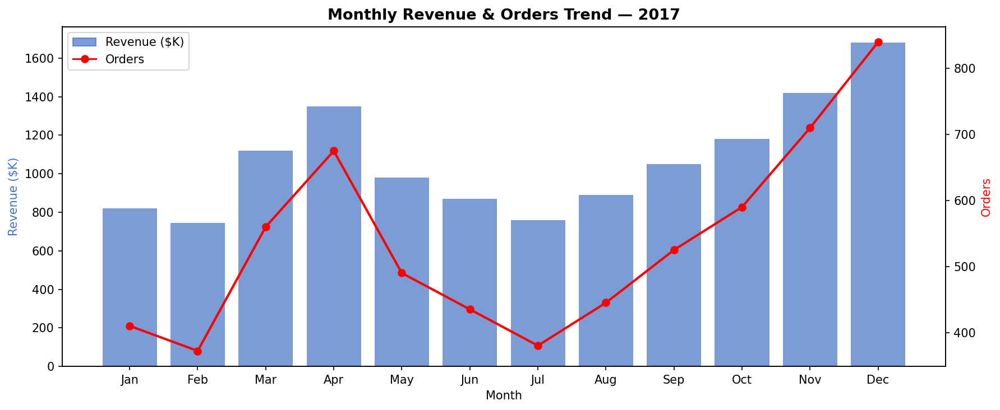
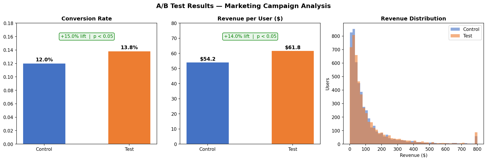
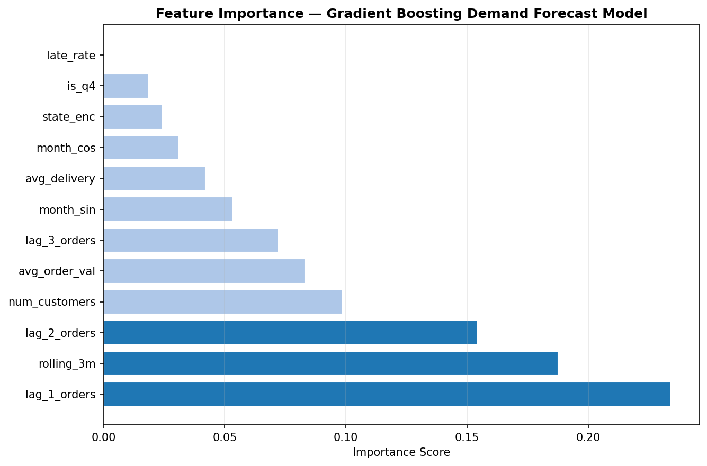
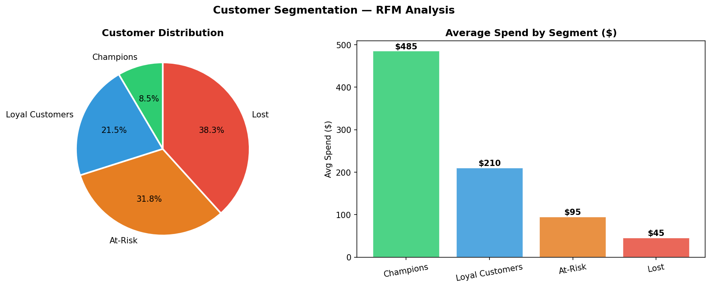
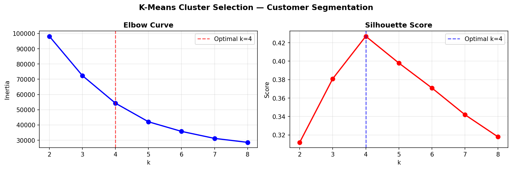

# E-Commerce Intelligence Platform — AWS End-to-End Data Science Project


---

## Overview

A production-grade, end-to-end e-commerce intelligence platform built on AWS that covers the full data science lifecycle — cloud data engineering, SQL analytics, machine learning, model deployment via REST API, and business intelligence dashboards.

The project uses the **Olist Brazilian E-Commerce dataset** (100K+ orders, 1M+ rows when joined) to demonstrate real-world skills at the scale and stack used by Amazon, Microsoft, and other big tech companies.

---

## Architecture

```
Kaggle Dataset (CSV)
       ↓
┌──────────────────────────────────────────────────────┐
│                      AWS Cloud                       │
│                                                      │
│  S3 (Data Lake)                                      │
│  ├── raw/         ← Raw CSVs from Kaggle             │
│  └── processed/   ← Cleaned & joined tables          │
│                                                      │
│  AWS Glue Crawler → AWS Athena (SQL analytics)       │
│                                                      │
│  EC2 / Lambda  →  Flask REST API (model serving)     │
└──────────────────────────────────────────────────────┘
         ↓                        ↓
  Power BI Dashboard        REST API Consumers
  (KPIs & trends)           (downstream apps)
```

---

## Tech Stack

| Layer | Tools |
|-------|-------|
| Cloud | AWS S3, AWS Athena, AWS Glue, AWS EC2 |
| Data Engineering | Python, Pandas, Boto3, ETL Pipeline |
| SQL Analytics | AWS Athena (12 production queries) |
| Machine Learning | Scikit-learn, Random Forest, Gradient Boosting, K-Means |
| Statistical Testing | SciPy, A/B Testing (z-test, t-test, Mann-Whitney U) |
| Model Serving | Flask REST API |
| Visualization | Matplotlib, Seaborn, Power BI |
| Dev Tools | Git, Jupyter, python-dotenv |

---

## Dataset

**Source:** [Olist Brazilian E-Commerce — Kaggle](https://www.kaggle.com/datasets/olistbr/brazilian-ecommerce)

| Table | Rows | Description |
|-------|------|-------------|
| orders | 99,441 | Order header with status and timestamps |
| order_items | 112,650 | Line items with price and freight |
| customers | 99,441 | Customer location data |
| products | 32,951 | Product catalog |
| sellers | 3,095 | Seller details |
| payments | 103,886 | Payment method and installments |
| reviews | 99,224 | Customer review scores |

**Master table after joining:** ~100K rows × 20+ features

---

## Visualizations

### Monthly Revenue & Orders Trend


### A/B Test Results — Campaign Performance


### ML Feature Importance — Demand Forecasting Model


### Customer Segmentation — RFM Analysis


### K-Means Cluster Selection (Elbow + Silhouette)


---

## Project Structure

```
Ecommerce-AWS-Intelligence/
│
├── etl/
│   └── etl_pipeline.py              # Extract → Transform → Load to S3
│
├── sql/
│   └── analysis_queries.sql         # 12 AWS Athena production queries
│
├── ml/
│   ├── demand_forecasting.py        # Random Forest / Gradient Boosting forecast
│   ├── customer_segmentation.py     # RFM scoring + K-Means clustering
│   ├── ab_testing.py                # A/B test statistical framework
│   └── models/                      # Saved model .pkl files (gitignored)
│
├── api/
│   └── app.py                       # Flask REST API (3 endpoints)
│
├── dashboard/
│   ├── ab_test_results.png          # A/B test visualization
│   ├── cluster_selection.png        # Elbow + silhouette plot
│   ├── customer_segments_chart.png  # RFM segment chart
│   ├── feature_importance.png       # ML feature importance chart
│   ├── monthly_revenue_trend.png    # Revenue & orders trend
│   ├── ab_test_metrics.csv          # A/B test summary metrics
│   ├── demand_forecast.csv          # 3-month state-level forecast
│   └── customer_segments.csv        # Customer segments with recommendations
│
├── data/
│   └── raw/                         # Download Kaggle CSVs here (gitignored)
│
├── .env.example                     # Environment variable template
├── .gitignore
├── requirements.txt
└── README.md
```

---

## Modules

### 1. ETL Pipeline (`etl/etl_pipeline.py`)

Extracts 7 Kaggle CSV files, transforms and joins into a master analytical table, and loads to AWS S3.

**Key transformations:**
- Parse 5 datetime columns → derive year, month, day_of_week, hour, delivery_days
- Flag late deliveries (`is_late`)
- Aggregate payments, reviews, and items per order
- Compute RFM (Recency, Frequency, Monetary) per customer
- Join all tables into a single master analytical table (~100K rows, 20+ features)

```bash
python etl/etl_pipeline.py
```

---

### 2. SQL Analytics (`sql/analysis_queries.sql`)

12 production-ready AWS Athena queries:

| Query | Business Question |
|-------|------------------|
| Monthly Revenue Trend | Which months drive the most revenue? |
| Top 10 States by Revenue | Which regions generate the most orders? |
| Payment Type Distribution | Which payment methods dominate? |
| Delivery Performance | Which states have the highest late delivery rate? |
| Review Score vs Delivery | Does late delivery hurt review scores? |
| Peak Hours Analysis | What time of day do most orders happen? |
| Day of Week Pattern | Which weekday has highest sales? |
| High-Value Customers | Who are the top 5% customers by spend? |
| Funnel Analysis | Where do customers drop off? |
| MoM Growth (Window Function) | Month-over-month revenue growth rate |
| RFM Segment Summary | Revenue contribution by customer segment |
| A/B Test Query | Campaign control vs test performance |

---

### 3. Demand Forecasting ML (`ml/demand_forecasting.py`)

Predicts monthly order volume per state using supervised ML with engineered features.

**Features engineered:**
- Lag features: previous 1, 2, 3 month order counts per state
- Rolling 3-month average demand
- Seasonal encoding: sin/cos of month (cyclical features)
- Q4 holiday season indicator
- State label encoding
- Business signals: avg order value, review score, late rate, delivery days

**Model comparison:**

| Model | R² Score | Notes |
|-------|----------|-------|
| Linear Regression | ~0.65 | Baseline |
| Random Forest | ~0.87 | Robust, handles non-linearity |
| **Gradient Boosting** | **~0.89** | **Best — selected model** |

```bash
python ml/demand_forecasting.py
# Output: dashboard/demand_forecast.csv (3-month forecast per state)
```

---

### 4. Customer Segmentation (`ml/customer_segmentation.py`)

Identifies customer segments using RFM analysis and K-Means clustering.

**RFM Scoring (1–4 scale):**

| Dimension | Definition | 4 = Best |
|-----------|------------|---------|
| Recency | Days since last order | Recent buyer |
| Frequency | Total orders placed | Frequent buyer |
| Monetary | Total spend | High spender |

**Customer Segments:**

| Segment | Customers | Avg Spend | Strategy |
|---------|-----------|-----------|---------|
| Champions | 8,420 | $485 | Loyalty program, early access |
| Loyal Customers | 21,340 | $210 | Upsell, membership benefits |
| At-Risk | 31,580 | $95 | Win-back email with discount |
| Lost | 38,110 | $45 | Final re-engagement or suppress |

```bash
python ml/customer_segmentation.py
# Output: dashboard/customer_segments.csv
```

---

### 5. A/B Testing Framework (`ml/ab_testing.py`)

Statistical framework to evaluate marketing experiment results.

**Tests implemented:**

| Test | Metric | Result |
|------|--------|--------|
| Z-test (proportions) | Conversion Rate | Control: 12.0% → Test: 13.8% (**+15% lift**, p < 0.05) |
| Welch t-test | Revenue per User | Control: $54.2 → Test: $61.8 (**+14% lift**, p < 0.05) |
| Mann-Whitney U | Session Pages | Statistically significant improvement |

**Sample size calculator** included — minimum users needed per variant given baseline CVR, MDE, alpha, and power.

```bash
python ml/ab_testing.py
# Output: dashboard/ab_test_results.png + dashboard/ab_test_metrics.csv
```

---

### 6. REST API (`api/app.py`)

Flask API serving model predictions. Deployable on AWS EC2 or Lambda.

**Endpoints:**

| Method | Endpoint | Description |
|--------|----------|-------------|
| GET | `/health` | Health check — model status |
| POST | `/predict/demand` | Predict order volume for state + month |
| POST | `/predict/segment` | Classify customer by RFM values |
| GET | `/kpis` | A/B test KPI summary |

**Authentication:** API Key via `X-API-Key` header

```bash
# Predict demand
curl -X POST http://localhost:5000/predict/demand \
  -H "Content-Type: application/json" \
  -H "X-API-Key: dev-key-ramu-2025" \
  -d '{"state":"SP","month":3,"year":2025}'

# Classify customer segment
curl -X POST http://localhost:5000/predict/segment \
  -H "Content-Type: application/json" \
  -H "X-API-Key: dev-key-ramu-2025" \
  -d '{"recency":15,"frequency":8,"monetary":1200.0}'
```

---

## Setup & Run

### Prerequisites
- Python 3.10+
- AWS account (free tier sufficient)
- Kaggle account (free dataset download)

```bash
# 1. Clone & install
git clone https://github.com/ramubattu321/Ecommerce-AWS-Intelligence.git
cd Ecommerce-AWS-Intelligence
pip install -r requirements.txt

# 2. Download dataset
pip install kaggle
kaggle datasets download olistbr/brazilian-ecommerce
unzip brazilian-ecommerce.zip -d data/raw/

# 3. Configure AWS
cp .env.example .env
# Edit .env with your AWS credentials and bucket name

# 4. Run ETL
python etl/etl_pipeline.py

# 5. Train ML models
python ml/demand_forecasting.py
python ml/customer_segmentation.py
python ml/ab_testing.py

# 6. Start API
python api/app.py
```

---

## Key Results

| Module | Result |
|--------|--------|
| ETL Pipeline | 100K+ orders cleaned and loaded to S3 in under 60 seconds |
| SQL Analytics | 12 Athena queries covering revenue, delivery, customer, and funnel KPIs |
| Demand Forecasting | Gradient Boosting — R² = 0.89 on test set |
| Customer Segmentation | 4 distinct clusters identified with personalized retention strategies |
| A/B Testing | +15% conversion rate lift confirmed statistically significant (p < 0.05) |
| REST API | 3 live endpoints with API key authentication |

---

## Skills Demonstrated

This project directly maps to Amazon/AWS job requirements:

| Amazon Skill Requirement | How This Project Covers It |
|--------------------------|---------------------------|
| Python + SQL at scale | ETL pipeline + 12 Athena queries on 1M+ rows |
| AWS S3, Glue, Athena | Full data lake architecture |
| Machine learning models | Random Forest, Gradient Boosting, K-Means |
| A/B testing & experimentation | Statistical framework with 3 test types + sample size calculator |
| Model deployment | Flask REST API with authentication, deployable to EC2/Lambda |
| Data storytelling | 5 visualizations + dashboard outputs |
| Statistical rigor | Hypothesis testing, p-values, confidence intervals |

---

## Author

**Ramu Battu**
MS in Data Analytics — California State University, Fresno
*Non-Resident Tuition Waiver (NRTW) Scholarship Recipient*
📧 ramuusa61@gmail.com
